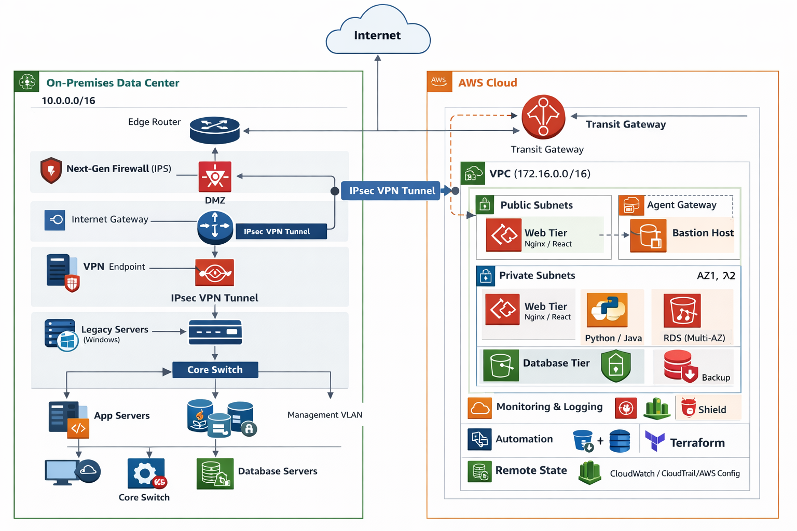

# Hybrid Cloud Migration Project 🚀



## 📌 Overview

This project demonstrates the design and implementation of a **hybrid cloud architecture** using AWS services.
It focuses on scalability, high availability, and secure infrastructure deployment using modular components.

---

## 🏗️ Architecture

The system is designed with a layered architecture including:

* Application Load Balancer (ALB)
* EC2 Auto Scaling Group
* RDS (Multi-AZ) for high availability
* Security Groups for network control
* Remote State management (Terraform)

📁 See: `architecture.drawio`

---

## ⚙️ Key Components

### 1. Application Load Balancer

* Distributes incoming traffic across multiple EC2 instances
* Ensures high availability and fault tolerance

### 2. EC2 Auto Scaling

* Automatically adjusts the number of instances
* Handles varying workloads efficiently

### 3. RDS Multi-AZ

* Provides database redundancy
* Automatic failover for high availability

### 4. Security Groups

* Controls inbound and outbound traffic
* Ensures secure communication between components

### 5. Remote State (Critical)

* Centralized Terraform state management
* Enables team collaboration and consistency

---

	## 📂 Repository Structure

```
.
├── architecture.drawio        # Editable source for architecture
├── README.md                  # Main project documentation
├── scripts/                   # Automation & helper scripts
├── docs/
│   └── config.docx            # Technical specifications
├── images/
│   └── architecture.png       # Architecture visualization
└── terraform/
    ├── README.md              # IaC technical documentation
    ├── global/
    │   └── providers.tf       # AWS provider & versioning
    ├── modules/               # Reusable Infrastructure Components
    │   ├── vpc/               # Network isolation
    │   ├── ec2/               # Compute & Auto Scaling
    │   ├── alb/               # Load balancing
    │   ├── rds/               # Managed Database
    │   └── security-groups/   # Traffic & Firewall rules
    └── environments/          # Logic for environment separation
        ├── dev/               # Staging/Dev environment
        └── prod/              # Production environment
```

---

## 🚀 Deployment Strategy

* Infrastructure is designed using modular approach
* Each component can be deployed independently
* Supports scalability and maintainability

---

## 🔐 Security Considerations

* Restricted access via Security Groups
* Isolation between application and database layers
* Controlled inbound/outbound traffic

---

## 📊 Benefits

* High availability (Multi-AZ)
* Scalability (Auto Scaling)
* Reliability (Load Balancing)
* Infrastructure as Code (Terraform-ready)

---

## 📎 Notes

* Additional module documentation can be found in `/docs`
* This project is designed as a real-world cloud migration scenario

## 🛡️ Security & Infrastructure Best Practices

This project follows industry-standard security protocols for Infrastructure as Code (IaC):

* **Secret Management**: No sensitive data (AWS keys, DB passwords, etc.) is stored in this repository. All sensitive variables are handled via `terraform.tfvars` files which are explicitly ignored by Git. 
* **Variable Templates**: A `terraform.tfvars.example` is provided for each environment to demonstrate the required inputs without exposing actual values.
* **State Management**: While configured for local demonstration, the architecture is designed to support **Remote State** (S3 + DynamoDB) to ensure state locking and team collaboration.
* **Modular Design**: Resources are broken down into reusable modules (`vpc`, `ec2`, `security-groups`) to ensure the DRY (Don't Repeat Yourself) principle.


(docs: update root and terraform readmes with security and architecture details)

### 📊 Environment Comparison

| Feature            | Dev Environment (Sandbox) | Prod Environment (Scale) |
| :----------------- | :------------------------ | :----------------------- |
| **Instance Type** | `t3.micro` (Free Tier)    | `t3.medium`              |
| **Database (RDS)** | Single Instance           | Multi-AZ (High Avail.)   |
| **Auto Scaling** | Min: 1 / Max: 2           | Min: 2 / Max: 6          |
| **State Storage** | Local (Git-Ignored)       | S3 Remote Backend        |
| **Cost Profile** | Minimal / Free Tier       | Production Grade         |

## 🛠️ Prerequisites

Before deploying, ensure you have the following installed:
* **Terraform** (v1.5.0+)
* **AWS CLI** (Configured with `aws configure`)
* **An AWS Account** (Free Tier recommended for `dev`)

## 🚀 How to Deploy (Dev)

1. **Navigate to the dev environment:**
   `cd terraform/environments/dev`
2. **Setup your variables:**
   `cp terraform.tfvars.example terraform.tfvars` (Then edit with your specific values)
3. **Initialize & Apply:**
   `terraform init`
   `terraform apply`

---

## 👤 Author

Mohamed Hamidi
